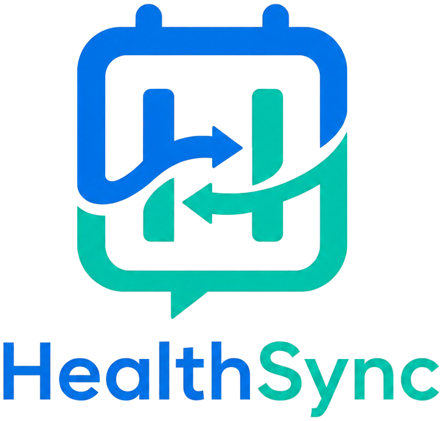
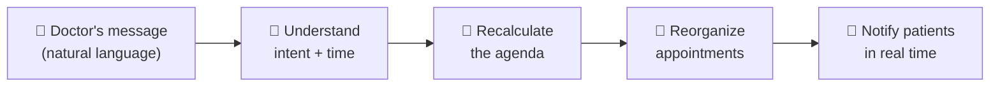

<div align="center">

  

  <h3>Tell it what happened — it reschedules the rest.</h3>

  <p><em>An intelligent medical scheduling system that turns a doctor's plain-language message<br/>into automatic, real-time adjustments to their workday.</em></p>

  <p>
    <a href="./LICENSE"></a>
    <a href="#-project-status"></a>
    
  </p>

</div>

<br/>

<div align="center">

💬 &nbsp; <em>"I had an emergency, I'll be 40 minutes late."</em>

</div>

HealthSync reads that message, understands the **intent** and the **time**, recalculates the day's agenda, reorganizes the affected appointments, and notifies the patients in real time — with no manual editing and no extra clicks.

---

## 🩺 The problem

A medical day rarely goes as planned. An emergency, a procedure that runs long, a personal matter — any of these shifts every appointment that follows. Today, absorbing that shift is manual work: the doctor (or their staff) reopens the calendar, drags appointments one by one, recalculates times, and calls or messages each patient.

That work is slow, error-prone, and happens at the worst possible moment — when the doctor is already behind.

## ⚙️ How it works

The doctor communicates the way they already do — in natural language — and the system does the rest.



| Step | What happens |
|------|--------------|
| **1. Understand** | Interprets the doctor's message: the intent (running late, cancel, free up time) and the magnitude (how much time, which window). |
| **2. Recalculate** | Re-plans the agenda based on the new reality of the day. |
| **3. Reorganize** | Shifts, compresses, or rebooks the affected appointments. |
| **4. Notify** | Tells the impacted patients in real time, automatically. |

> The goal is a scheduling assistant that behaves like a competent human secretary — one who never misreads a message and never forgets to notify a patient.

## ✨ Why this project exists

HealthSync is built as an **educational open-source project** for a workshop with the **Dev Senior Code** community.

It exists to be a realistic, end-to-end product that we design and build in the open — a vehicle for learning solid software practices on a problem that is genuinely hard and genuinely useful. The codebase is meant to be read, questioned, and extended.

It is **open for extension**: if the project finds momentum beyond the workshop, the foundations are intended to support it.

## 🚧 Project status

> [!IMPORTANT]
> **Early — we are still defining how the project will work.**
>
> There is **no code yet**, and technologies, architecture, and methodology are intentionally **not decided**. We are starting from the product and the foundations, on purpose, before writing a single line of implementation.

What this means right now:

- The shape of the project (stack, structure, process) is open and will be decided deliberately.
- Product specification and architecture docs will be added **once we define how the project works**.

## 🗺️ Roadmap

> A high-level direction, not a commitment to scope or dates.

- [x] Define the product vision and the open-source foundations *(this README + license)*
- [ ] Decide how the project will work (process, structure, conventions)
- [x] Specify the product — see the [PRD](./docs/PRD.md) *(personas, use cases, scope)*
- [ ] Choose the technical foundations
- [ ] Build the first working slice

## 🛠️ Development

The monorepo contains three apps under `apps/`:

| App | Stack | Port |
|-----|-------|------|
| `apps/language` | FastAPI (Python) | 8000 |
| `apps/scheduling` | NestJS (TypeScript) | 3000 |
| `apps/web` | React + Vite (TypeScript) | 5173 |

Each app is self-contained with its own toolchain.

**Local (no Docker)** — requires Python ≥ 3.11, Node, and pnpm. A `Makefile` at the
repo root orchestrates the three apps:

```bash
make install   # install dependencies for all three apps
make dev       # run all three in parallel (Ctrl-C stops all)
make help      # list every target
```

You can also run a single service: `make dev-language`, `make dev-scheduling`,
or `make dev-web`. If your default `python3` is older than 3.11, point the venv
at a newer one: `make install PYTHON=python3.12`.

**Docker** — run everything in containers (also starts Postgres):

```bash
docker compose up
```

See each app's `README.md` for more detail.

## 🤝 Contributing

> [!NOTE]
> This is a workshop project and is **not open to external contributions at this time**. You are welcome to read, study, fork, and learn from it under the terms of the license.

## 📄 License

HealthSync is released under the **GNU General Public License v3.0**. See [`LICENSE`](./LICENSE) for the full text.

In short: you are free to use, study, share, and modify this software, provided that derivative works remain free under the same license.

---

<div align="center">
  <sub>Copyright (C) 2026 victorolave.</sub>
</div>
