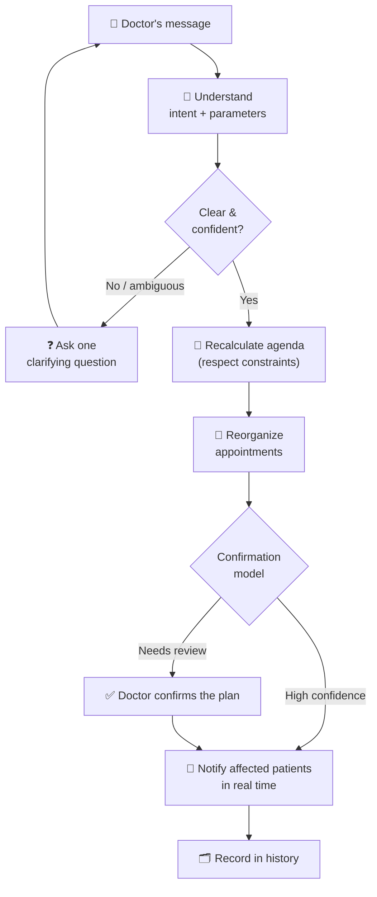

# HealthSync — Product Requirements Document (PRD)

| | |
|---|---|
| **Status** | Approved |
| **Version** | 1.0 |
| **Last updated** | 2026-05-25 |
| **Owner** | victorolave |

> This document defines **what** HealthSync is, **who** it serves, and **why** — not **how** it is built. No technology, architecture, or implementation decisions belong here.

---

## 1. Overview & Vision

A medical day rarely goes as planned. An emergency, a procedure that runs long, a personal matter — any of these shifts every appointment that follows. Absorbing that shift is manual, slow, and error-prone, and it always happens at the worst moment: when the doctor is already behind.

**HealthSync turns a doctor's plain-language message into automatic, real-time adjustments to their workday.** The doctor writes the way they already speak — *"I had an emergency, I'll be 40 minutes late"* — and the system interprets the intent, recalculates the agenda, reorganizes the affected appointments, and notifies the impacted patients. No manual editing, no extra clicks.

> **Vision:** A scheduling assistant that behaves like a competent human secretary — one who never misreads a message and never forgets to notify a patient.

**Value proposition**

- **For the doctor:** reclaim time and attention; communicate once, in natural language, and trust the rest is handled.
- **For the patient:** never wait in the dark; learn about changes the moment they happen.
- **For the clinic:** fewer no-shows, fewer angry calls, a calmer front desk.

## 2. Goals & Non-Goals

### Goals

- **G1** — Interpret a doctor's natural-language message into a concrete schedule **intent** and its **parameters** (how much, when, who).
- **G2** — Automatically **recalculate** the day's agenda to reflect the new reality.
- **G3** — **Reorganize** the affected appointments (shift, compress, rebook, or cancel) while respecting scheduling constraints.
- **G4** — **Notify** impacted patients in real time, clearly explaining what changed.
- **G5** — Require **zero manual editing** for the common disruption cases.
- **G6** — **Escalate gracefully** when a message is ambiguous or a safe automatic decision is not possible.

### Non-Goals

> What HealthSync **fundamentally is not** — permanent boundaries, distinct from things merely deferred (see §8).

- **NG1** — Not an Electronic Medical Record (EMR/EHR) or clinical documentation system.
- **NG2** — Not a billing, invoicing, or payments platform.
- **NG3** — Not a public patient-facing booking marketplace.
- **NG4** — Not a replacement for human judgment in clinically sensitive decisions — it acts on logistics, never on care.

## 3. Personas

### Primary — Dr. Elena Ruiz, specialist

- **Context:** Sees 15–25 patients a day on a tight schedule. Often mid-procedure when plans change.
- **Goals:** Communicate a disruption in seconds and move on; trust the schedule and patients are handled correctly.
- **Frustrations:** Reopening the calendar mid-day, dragging appointments one by one, chasing patients by phone.
- **Success looks like:** One message → the day is fixed and everyone is informed, without her touching the calendar.

### Primary — Marcos, patient

- **Context:** Has an appointment today; planned his day around it.
- **Goals:** Know as early as possible if anything changes; understand his options.
- **Frustrations:** Showing up to a delayed or cancelled appointment with no warning.
- **Success looks like:** A timely, clear message — *"Dr. Ruiz is running ~40 min late; your appointment moves from 3:00 to 3:40."*

### Secondary — Carla, clinic coordinator *(future)*

- **Context:** Oversees the front desk and the day's flow across one or more doctors.
- **Goals:** Visibility into changes; a way to step in for exceptions the system escalates.
- **Frustrations:** Being the manual relay between doctors and patients.
- **Success looks like:** The routine reshuffles happen automatically; she handles only the genuine exceptions.

## 4. Core Capabilities

### 4.1 Natural-language intake

Accept a free-text message from the doctor through a conversational channel. The doctor is never asked to fill a form or pick from menus.

### 4.2 Intent & parameter understanding

Translate the message into a **structured intent** plus its parameters. The initial intent taxonomy:

| Intent | Meaning | Key parameters |
|--------|---------|----------------|
| `DELAY` | Running late | duration, starting from when |
| `EARLY` | Running ahead / finished early | how much earlier / available now |
| `EXTEND` | A specific appointment will run longer | which appointment, extra duration |
| `BLOCK_TIME` | Reserve/free a window for something | time window, duration |
| `CANCEL_BLOCK` | Cancel a range or the rest of the day | time range |
| `CANCEL_DAY` | Cancel the whole day | the day |

### 4.3 Agenda recalculation

Given a disruption and the current agenda, produce a **new valid agenda** that honors scheduling constraints (no overlaps, respect appointment durations, working hours, breaks).

### 4.4 Appointment reorganization

Apply the recalculated agenda by **shifting, compressing, rebooking, or cancelling** the affected appointments — choosing the least-disruptive option for patients.

### 4.5 Patient notification

Inform each impacted patient in **real time**, stating clearly **what changed** and, when relevant, **what they can do** (confirm, request a different time).

### 4.6 Confirmation model

Before applying changes, the system can either **propose a plan for the doctor to confirm** or **act automatically** for high-confidence, low-risk cases. *(Which mode is default is an open question — see §10.)*

### 4.7 History & audit

Keep a record of every interpreted message, the resulting plan, and the notifications sent — so changes are traceable and explainable.

## 5. Product Flow

> The end-to-end loop, including the two decision points that make the logic non-trivial: **ambiguity** (clarify before acting) and the **confirmation model** (auto-apply vs. doctor review).

## 6. Key Scenarios

> The heart of the product. Each scenario is an **example-driven contract**: a real message in, a defined behavior out. These become acceptance criteria later.

### Scenario 1 — Running late

- **Message:** *"I had an emergency, I'll be 40 minutes late."*
- **Interpretation:** intent = `DELAY`, duration = 40 min, from = now.
- **System action:** Shift all of today's remaining appointments forward by ~40 min, respecting working hours; flag any appointment pushed past closing time for review.
- **Patient experience:** Each affected patient is told their appointment moves (e.g., *"3:00 → 3:40"*) and why, in plain terms.
- **Edge cases:** Appointments pushed past end-of-day; patients who can no longer make the new time; a later gap that could partly absorb the delay.

### Scenario 2 — Cancel the afternoon

- **Message:** *"Family emergency — cancel my afternoon."*
- **Interpretation:** intent = `CANCEL_BLOCK`, range = this afternoon.
- **System action:** Cancel afternoon appointments; offer affected patients the earliest viable rebooking options.
- **Patient experience:** Notified of the cancellation with a clear, empathetic message and next steps to rebook.
- **Edge cases:** Time-sensitive appointments; patients who already departed for the clinic.

### Scenario 3 — Free up a window

- **Message:** *"I need 30 minutes free at 3pm."*
- **Interpretation:** intent = `BLOCK_TIME`, window = 15:00, duration = 30 min.
- **System action:** Reserve the window and reorganize surrounding appointments around it.
- **Patient experience:** Only patients whose times move are notified; everyone else is untouched.
- **Edge cases:** Not enough slack in the day to absorb the block without overflow.

### Scenario 4 — Finished early

- **Message:** *"I'm done early, I can start seeing people sooner."*
- **Interpretation:** intent = `EARLY`, available from = now.
- **System action:** Offer to pull upcoming appointments forward — **with patient consent**, never silently.
- **Patient experience:** Invited to come earlier; the original time stays valid if they decline.
- **Edge cases:** Patients who cannot arrive earlier; cascading effects if some accept and others don't.

### Scenario 5 — Ambiguous message

- **Message:** *"Running behind."*
- **Interpretation:** intent = `DELAY`, duration = **unknown**.
- **System action:** Do **not** guess. Ask one clarifying question: *"About how many minutes behind?"*
- **Patient experience:** No premature or incorrect notifications are sent.
- **Edge cases:** Doctor doesn't reply; conflicting follow-up messages.

### Scenario 6 — Appointment running long

- **Message:** *"The 2pm will run 30 minutes longer."*
- **Interpretation:** intent = `EXTEND`, appointment = 14:00, extra = 30 min.
- **System action:** Extend that appointment and shift only the appointments that follow it.
- **Patient experience:** Only downstream patients are notified of their shifted times.
- **Edge cases:** The extension collides with a hard end-of-day boundary.

## 7. Scope & Prioritization (MoSCoW)

> Ruthless classification protects V1 from scope creep. Every requirement is in exactly one bucket.

### 🔴 Must have — *V1 fails without these*

- Natural-language intake through a single channel (§4.1).
- Interpret **`DELAY`** and **`CANCEL_BLOCK`** into intent + parameters (§4.2).
- Agenda recalculation respecting constraints (§4.3).
- Appointment reorganization: shift and cancel (§4.4).
- Real-time patient notification of what changed (§4.5).
- The **clarification path** for ambiguous messages (Scenario 5).
- Basic change history (§4.7).
- Single doctor, single working day, one timezone.

### 🟡 Should have — *important, but V1 survives day one without them*

- The `EARLY`, `EXTEND`, and `BLOCK_TIME` intents.
- A **propose-and-confirm** confirmation model (§4.6).
- Notification **delivery confirmation** and fallback.
- Patient **accept/decline** on "come earlier" (Scenario 4).

### 🟢 Could have — *nice if time allows*

- The `CANCEL_DAY` intent.
- Rebooking **suggestions with options** for cancelled appointments.
- Read-only visibility for a coordinator (Carla).
- Smart suggestions when a reshuffle overflows the day.

### ⚪ Won't have (this version) — *conscious exclusions that protect the core*

- Multi-doctor / multi-clinic coordination.
- Patient-initiated rescheduling negotiation beyond accept/decline.
- Recurring or multi-day appointment series.
- Voice input.
- Multi-language understanding.
- Payments, EMR, or clinical data (also permanent Non-Goals — see §2).

## 8. Future Vision — The Open Door

> What we deliberately defer **but keep on the radar**, so the product and its design stay open to extension. These are product directions, **not** technology choices — they exist so that early decisions don't quietly close future doors.

| Direction | Why it's on the radar | Design implication (open door) |
|-----------|----------------------|-------------------------------|
| **More intents** | The taxonomy (§4.2) will keep growing (e.g., reschedule a specific patient, recurring series). | Treat the intent set as **open for extension**, not a fixed, hard-coded list baked into the flow. |
| **Multi-doctor & coordinator role** | Carla's persona becomes active; clinics have many doctors. | Do **not** hard-code single-doctor assumptions into the agenda model. |
| **Multiple channels** | Doctors and patients will use different channels to write and be notified. | Keep **intake** and **notification** channel-agnostic. |
| **Multi-language understanding** | The audience is not limited to one language. | Keep **language understanding** separable from scheduling logic. |
| **Patient-initiated negotiation** | Patients may want to propose alternatives, not just accept/decline. | Model the patient as an **active participant**, not only a recipient. |

## 9. Success Criteria

> Targets that tell us HealthSync works — for users **and** as a teaching artifact.

### Product

- **Interpretation accuracy:** the common scenarios (§6) are interpreted into the correct intent and parameters reliably.
- **End-to-end automation:** an in-scope disruption is resolved with **a single message** and **no manual calendar editing**.
- **Notification completeness:** **no impacted patient is ever left un-notified**; no double-bookings; no lost appointments.
- **Speed:** time from the doctor's message to all patients notified is perceived as **near real time**.
- **Safety:** ambiguous or risky cases are **escalated, never guessed**.

### Educational (workshop)

- The codebase reads clearly: each capability in §4 is **independently understandable**.
- A participant can trace one scenario (§6) from message to notification and explain every step.

## 10. Assumptions, Risks & Open Questions

### Assumptions

- Doctors will trust automation enough to communicate in natural language rather than editing a calendar.
- Patients are reachable through the chosen notification channel and will read messages in time.
- Appointments have known, reasonably accurate durations.

### Risks

- **Misinterpretation (high stakes):** acting on a wrong intent could displace the wrong patients. Mitigation: confidence thresholds and the clarification path.
- **Notification failure:** a patient who isn't reached effectively wasn't notified. Mitigation: delivery confirmation and fallbacks.
- **Trust & safety in a medical context:** the cost of a logistics error is higher than in most consumer apps.

### Open questions

- **Confirmation model:** is the default **propose-and-confirm** or **auto-apply** for high-confidence cases? (§4.6)
- **Language(s):** which language(s) must the system understand at launch?
- **Channels:** through which channel does the doctor write, and through which are patients notified?
- **Conflict resolution:** when a reshuffle has no clean solution (e.g., overflow past closing), what is the fallback policy?

> These open questions are intentional. They are product decisions to be resolved before — or as part of — defining the technical foundations. They are **not** technology choices.

---

## Revision History

| Version | Date | Status | Change |
|---------|------|--------|--------|
| 1.0 | 2026-05-25 | Approved | First version. |
